# LeGuideBienPenard

## Presentation

Ce projet respect une architecture MVC avec un singletons dans un application android codé en Java.  
Cette application est une check-list d'objets nécessaires afin de passer un bon confinement.  
Elle dispose également de session utilisateurs afin de proposer des check-lists propres à chacun.  
Cette application utilise le service d’authentification Firebase de Google, elle fait également des appels API Rest sur la real-time database de Firebase.

## Prérequis

- Installation d’Android Studio.
- Import du SDK Firebase authentification sur Android Studio.
- Récupérer la branche develop

## Consignes respéctées

- Écran avec une liste d’éléments.
- Écran avec le détail d’un élément.
- Appel WebService à une API Rest, PATCH, PUT, GET.
- Stockage de données en cache.
- Fonctions supplémentaires :
  - Utilisation d’une architecture MVC.
  - Utilisation de fragment.
  - Utilisation de Singletons.
  - Respect d’un Gitflow.
  - Écran d’authentification avec création de compte et vérification du courriel.
  - Attention particulière sur le design global de l'application.

## Fonctionnalités

### Écran de connexion

- Le premier écran affichant un champ identifiant et mot de passe.

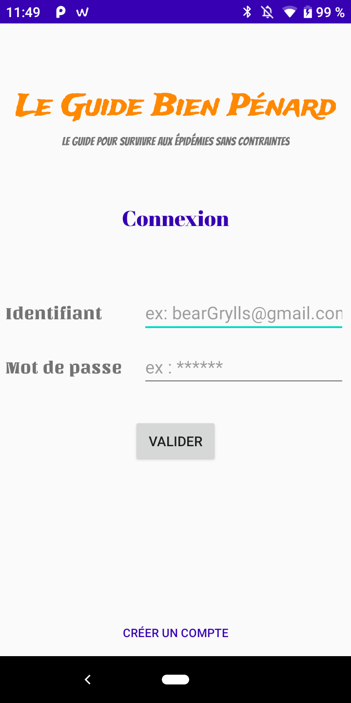

- Les champs entrés sont vérifiés et affichent une erreur si une donnée n'est pas conforme.

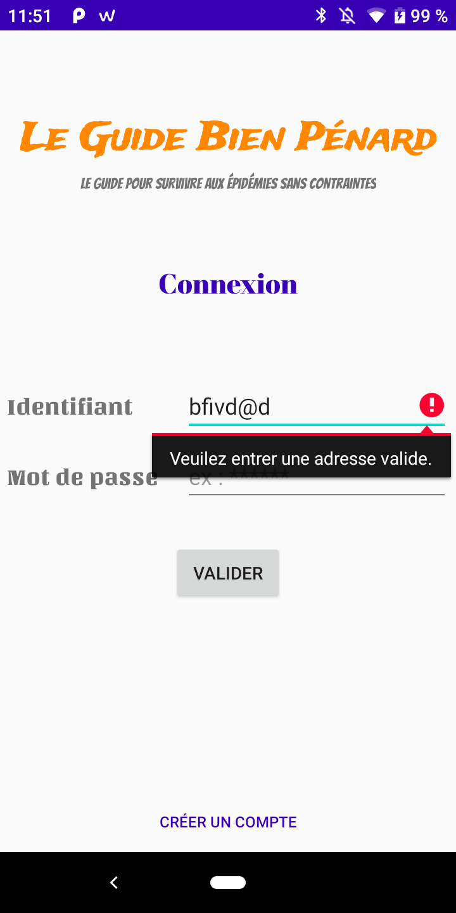  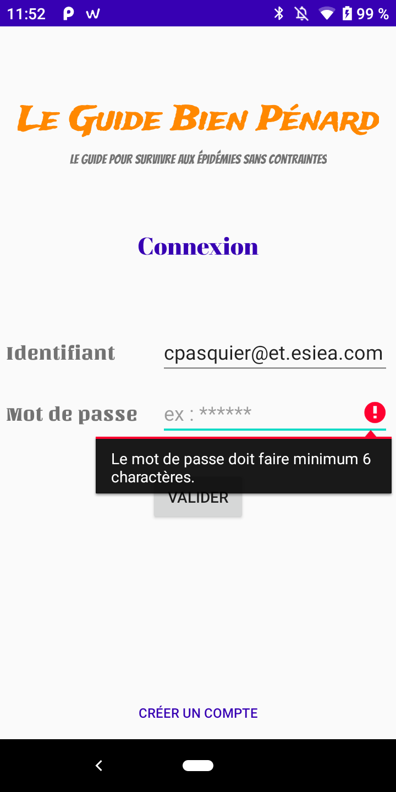

- En bas de l'écran, un bouton créé compte permet de changer l'interface afin de créer un compte.

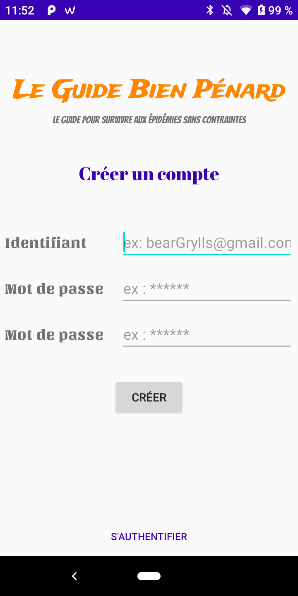  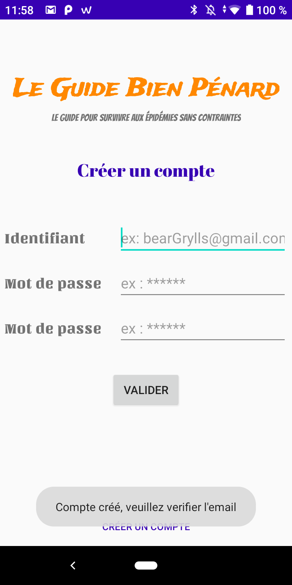

- Quand un compte est créé, un e-mail de vérification est envoyé sur l’adresse renseignée.

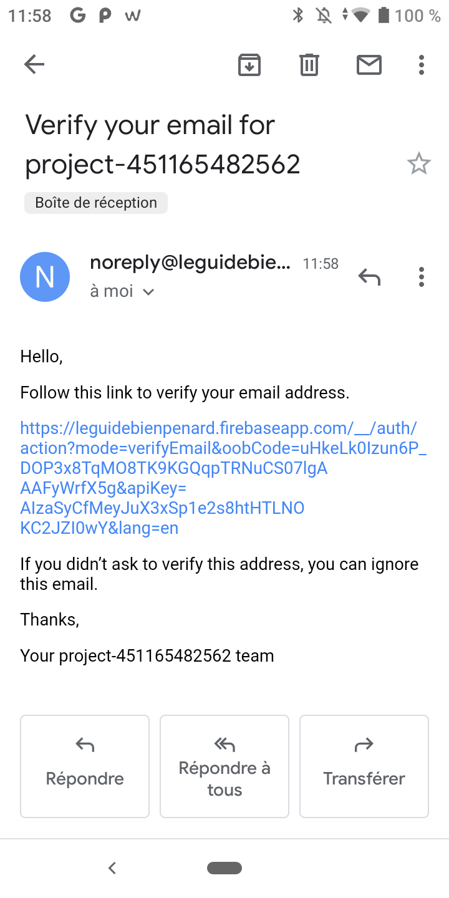  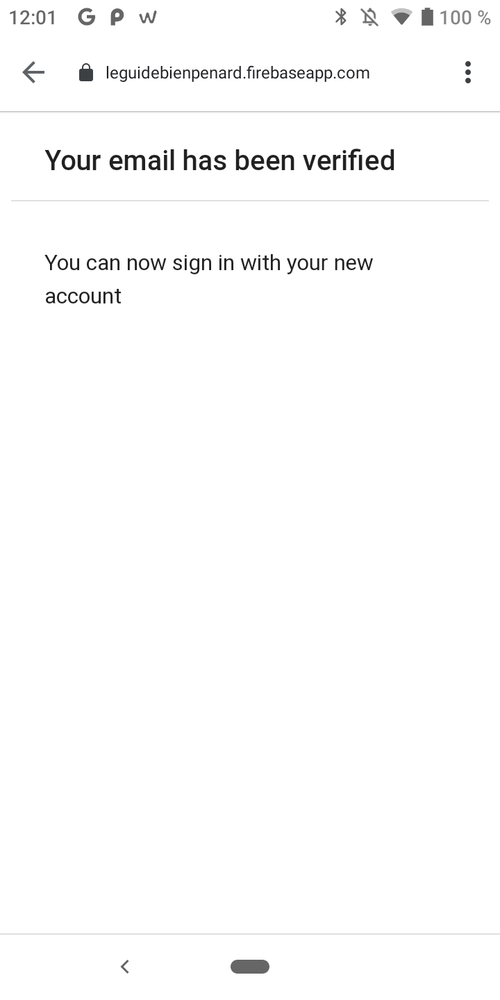 

### Écran principal

- L'affichage de l'écran principal commence par une progressBar, elle est présente le temps que l'appel à l’API n’a pas de réponse.

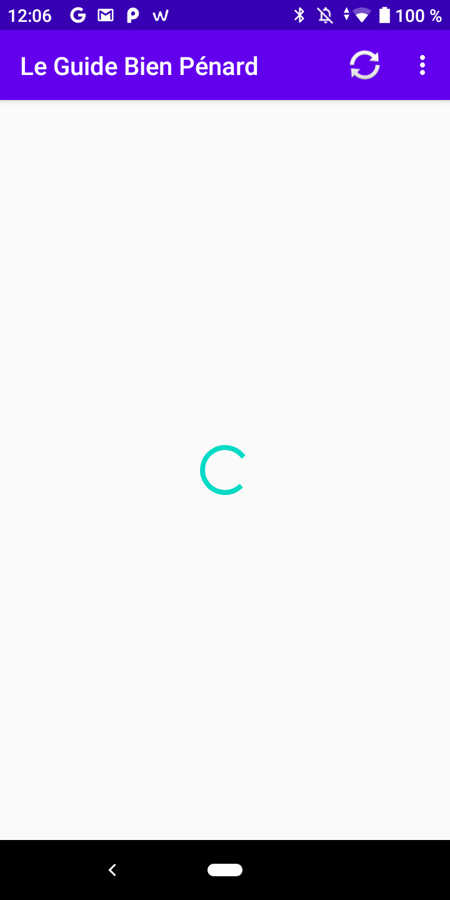

-	Si vous êtes connecté au réseau, la progressBar disparaît et l’écran affiche un recyclerView avec les éléments de réponse à l’appel API Rest. Ces éléments sont des objets et comporte un champ checkbox qui signifie que vous le possédez ou non.

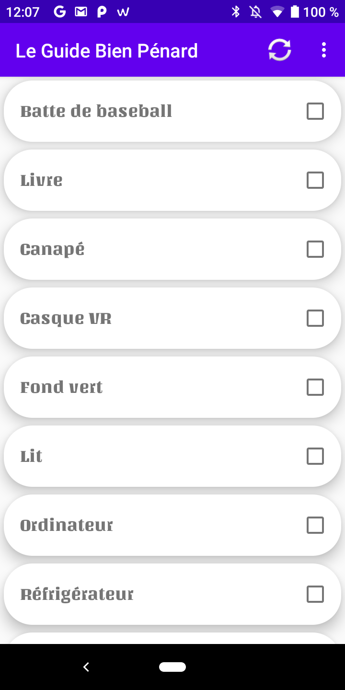

-	Lors d’un clic sur une checkbox une requête de type PUT et envoyé sur l’API Rest afin d’enregistrer la modification. 

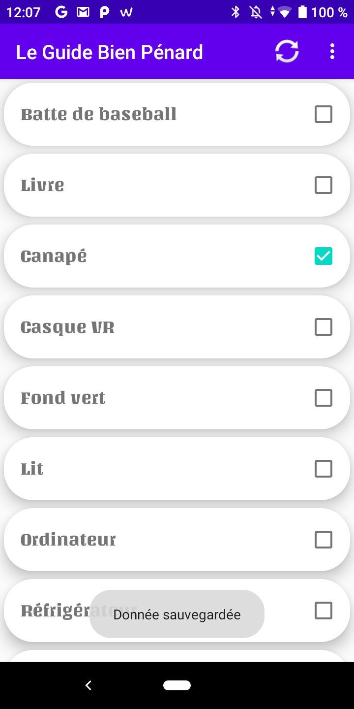

-	Si vous n’êtes pas connecté au réseau, une fenêtre pop-up viendra vous notifier que vous n’êtes plus connecté et que les modifications faites ne seront pas enregistrées. Dès lors la recyclerVIew utilisera des données sauvegardées en cache. Cette fonctionnalité peut être testée en se déconnectant du réseau et en rafraîchissant la page à l’aide du bouton en haut à droite.

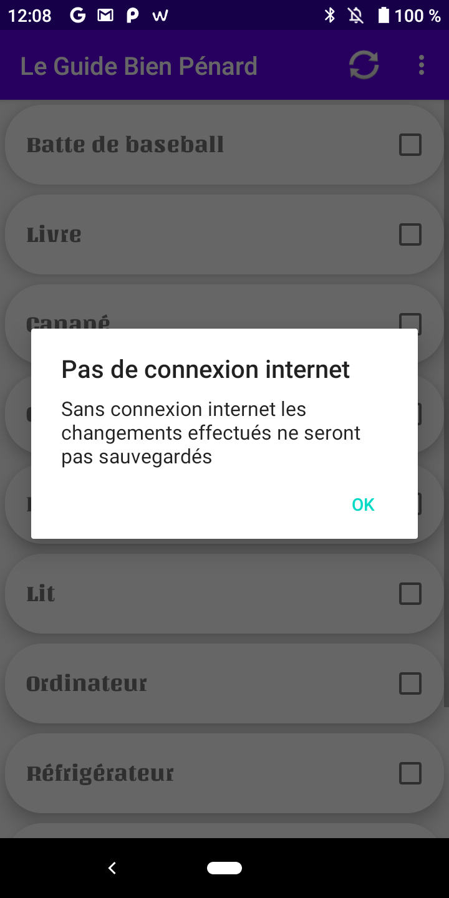

### Écran détails des objets

-	Cet écran affiche les détails sur l’objet cliqué dans la recyclerView. Les données affichées sont pré-chargé en cache dans l’écran précédant. 
Les informations sur l’objet sont :
    - Son importance.
    - Les lieux où on peut le trouver.
    - Une courte description.

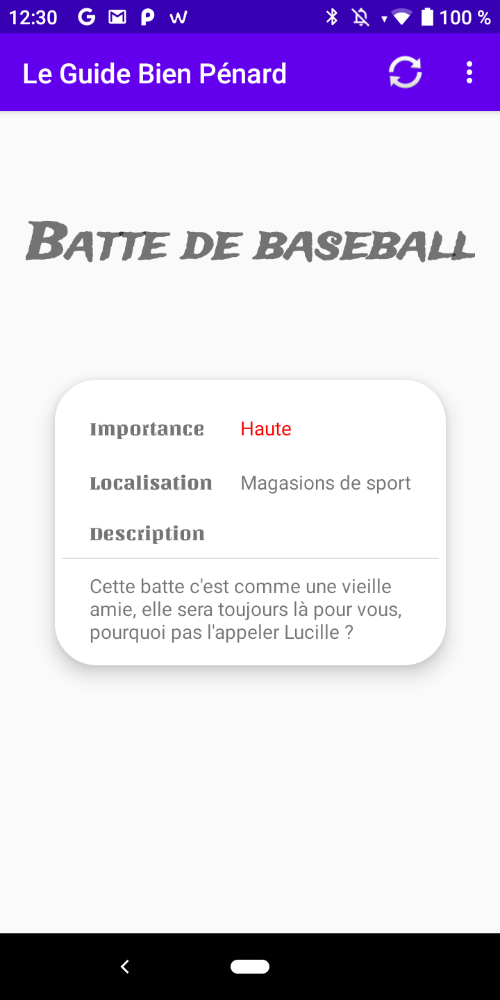  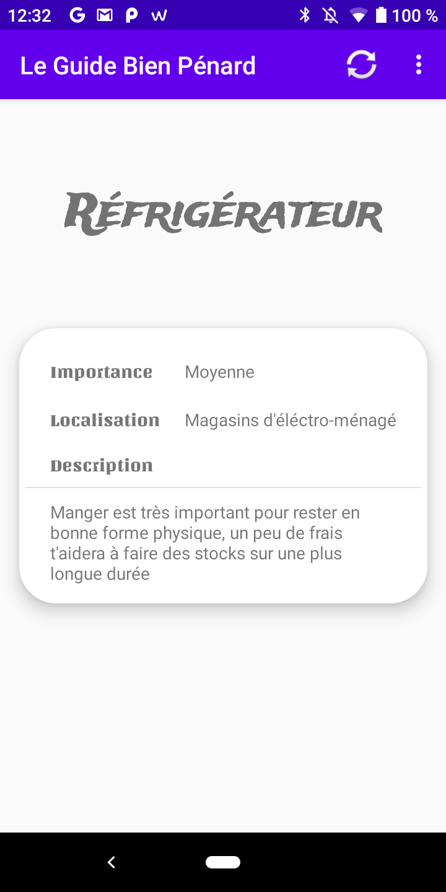  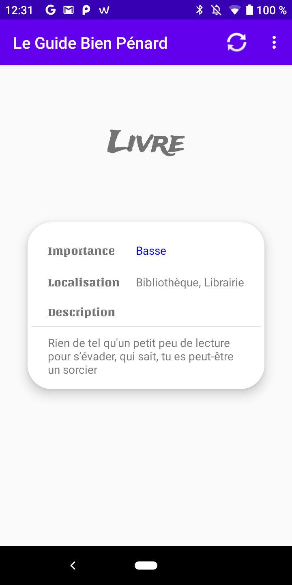

